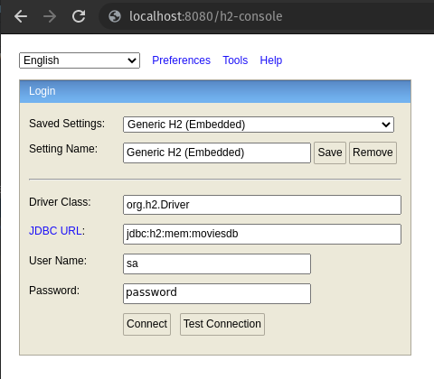

# Golden Raspberry Awards

### Download and build

```
git clone https://github.com/lfantinel/GoldenRaspberry.git
cd GoldenRaspberry
mvn clean package
```

### Run tests

```
mvn test
```

### Run Application

```
java -jar target/GoldenRaspberry-0.0.1-SNAPSHOT.jar
```

### Api docs (swagger)

- http://localhost:8080/api/swagger-ui.html

### H2 Console

- http://localhost:8080/h2-console
- **JDBC URL:** jdbc:h2:mem:moviesdb
- **User Name:** sa
- **Password:** password


